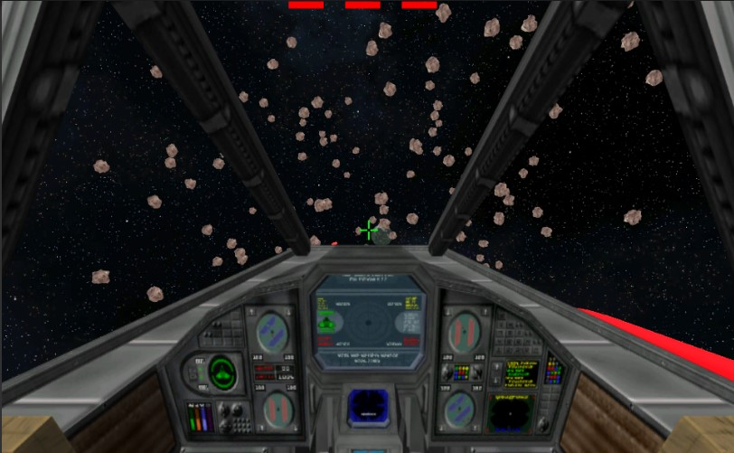

Deployment: https://guipleite.github.io/SpaceWing/
 
Controles:

    Movimento: W,A,S,D

    Torque(Nave): Barra de Espaço

    Atirar: Botão esquerdo do mouse

O objetivo é precuperar um artefato perdido no templo. Para isso é preciso pousar no planeta e desviar dos asteroides .
 

